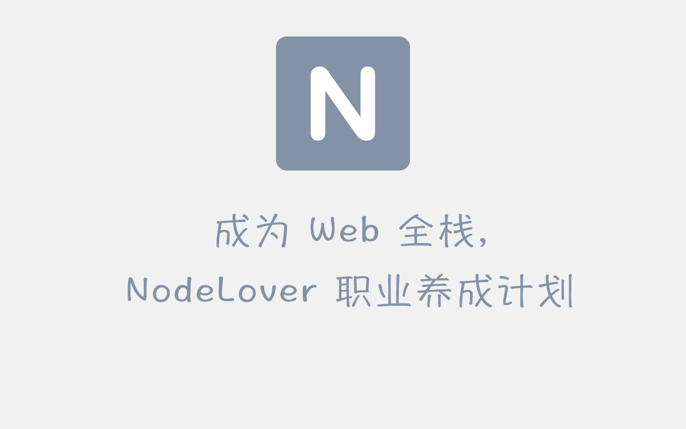

| 符号 | 意义     |
| ---- | -------- |
| 🆓   | 免费课程 |

## 如何成为像我一样的工程师？

> 我没法告诉你如何更优秀，至少我可以告诉你如何做到像我一样。

首先第一点就是，你愿意，而不是想，主观的行动上去阐述你想要跟我一样，而不是想、说，简单点说就是你要实干，实打实的干。

现在你拥有了一个目标，像我一样，不停努力。如何才能看到希望呢？这是你心中亟待想要问出的问题，李笑来写过一些书，我在 Kindle 上读过一些书，其中有一本书叫《学习学习再学习》，也就是说，大多数人是不会学习的，第一个学习是动词，第二个是名词，所以你可以写学会学习。

当然很多人说李笑来是个大忽悠，我觉得吧，马云在别人面前也是个大忽悠。这个忽悠的解释我觉得是某个人在阐述某个问题，然后努力想要说服对方，但是对方半信半疑，觉得这个人好像在忽悠自己。在不是特别了解别人的情况下，说别人坏话其实是不道德的行为，有人说道德不值几个钱，是不值几个钱，但是有的你有钱也买不到，这就是它的价值。就像快要上映的《爵迹2》，大多数人都是喷的，很大的程度上就是对导演个人的成见，对于郭敬明我怎么看？不怎么看，我不了解他，网上很多人说他抄袭，到底是不是我不知道，也没怎么看他写的文章。哪怕抄袭了，我不是说抄袭是对的，也没说他一定抄袭了，但是假如是在一个平常人身上，这其实很正常，谁上小学还没抄过作业呢？而是名人效应的、流言以及过错放大化。单纯的电影，我觉得爵迹挺好的。这说明了，最简单的道理你都懂，但是你不会去做而已，当然确实有的言语就是诡辩，你要分别清楚，比如区块链，所以我不是韭菜。你父母告诉你的，基本都是正确的，只有正确的导向，你才能到达目的地。

现在你知道了如何学习，像优秀的人学习，但不要迷信。现在开始使用最笨的方法，付出努力，把隐性的知识转化为显性的技能，那么始终是有些方法吧？说实话，方法是什么，我也不知道，可能是多 Google 吧，我曾经读过一些番茄工作法、GTD、如何高效学习，基本上都没怎么用上。能用上的反而是最简单的，一天就做一件事，做完一件下一件，竭尽所能去做。

具体到职业，我大概经历了那么几个阶段。什么都不知道，html 是什么？css 是什么？jquery 是什么？这就是第一个阶段，百问阶段。学习了一段时间后，基本上了解一个页面是如何组成的了，可以自己独立的写一些简单的小界面，但是熟练度不行，这是第二个阶段，开始需要熟练 API，其实前端的 API 比后端的多很多，前端可以精分出来的职业也比较多，这个时间是最长的，可能一年，也可能两年，并非到第三第四阶段，第二阶段就结束了。在这期间，你会遇到一些效果，自己怎么做都没有思路，好像 API 就这些，但是为啥我就做不出来呢？然后你就各种找插件去拼凑出自己的效果，但是现在你对内部的实现原理还是一知半解的，至少现在你能把东西都做出来了，你可能会出现一个膨胀期，简历上写出各种精通、精通、精通。待你真正遇到需要定制化的问题的时候，就会变的寸步难行了，所以你开始了研究源码之路，包括学习各种新技术，研究了一段时间之后，源码是一碗水，你喝完之后，发现它变成了一桶水，再喝完之后变成了一池子的水，最后发现这简直就是一片汪洋大海，自己根本喝不完这么多。然后这辈子就这么完了，找不到岸边在哪儿了。现在剩下的只有谦虚。其实这么多水，每一种水都有一种味道的话，相信到了现在你会忘记某一次喝的水的味道了。技术点不重要，重要的是以后的修仙路，给自己铺路。

### 🌠 构建静态网页

##### 1️⃣ [90 分钟 HTML](https://nodelover.me/course/90-minutes-in-html) 🆓

HTML 是构建网页的骨骼，第一步就是学会搭建骨骼。

##### 2️⃣ CSS

* [CSS 基础](https://nodelover.me/course/css-basic) 🆓
* [CSS3](https://nodelover.me/course/css3) 🆓
* [Flex 布局](https://nodelover.me/course/css-flex) 🆓

CSS 是网页的血与肉，一个人的颜值取决于五官与胖瘦，网页的美观取决于样式。

##### 3️⃣ JavaScript 基础

JavaScript 是奇经八脉，它可以让你的网页能歌善舞。

* [JavaScript 语法](https://nodelover.me/course/js-start-1) 🆓
* [JavaScript 全局对象](https://nodelover.me/course/js-start-2) 🆓
* [JavaScript 正则表达式](https://nodelover.me/course/regexp) 🆓
* [JavaScript Canvas 动画](https://nodelover.me/course/canvas) 
* [ES 6 入门](https://nodelover.me/course/es6) 🆓
* [JavaScript 异步控制流](https://nodelover.me/course/js-async) 🆓

##### 4️⃣ [Stylus](https://nodelover.me/course/stylus)

Stylus 让你的 CSS 支持可编程化，减少重复的工作

##### 5️⃣ [iMovie 与 Gulp](https://nodelover.me/course/gulp)

带你走进一个前端开发栈的搭建

##### 6️⃣ [iMovie HTML 组件化开发实战](https://nodelover.me/course/imovie-static)

组件化可复用思维，搭建一个 App 应用

##### 7️⃣ [前端特效](https://nodelover.me/course/codepen)

带你实现酷炫的前端特效

##### 8️⃣ [WebPack](https://nodelover.me/course/webpack-4) 🆓

Webpack 是现代化的前端处理器，帮助你编译与预处理各种文件

##### 9️⃣ [Chrome 技巧库](https://nodelover.me/course/chrome)

Chrome 是每天都要接触的东西，吃透它，才能更好的开发

##### 🔟 Vue 全家乐

* [Vue 基础](https://nodelover.me/course/vue-basic) 🆓
* [Vue 初级](https://nodelover.me/course/vue-advance-1) 🆓
* [Vue 高级](https://nodelover.me/course/vue-advance-2) 🆓
* [构建一个最小的 Vue](https://nodelover.me/course/tiny-vue)
* [Vue 状态管理](https://nodelover.me/course/vuex)
* [Vuex 源码解析](https://nodelover.me/course/vuex-source)
* [Vue 路由](https://nodelover.me/course/vue-router)
* [Vue 路由源码解析](https://nodelover.me/course/vue-router-source)
* [Vue 实战之番薯 APP](https://nodelover.me/course/vue-blog) 🆓
* [Vue 服务端渲染](https://nodelover.me/course/vue-ssr)

##### ☑️ 其他高级进阶课程

* [RxJS 深入](https://nodelover.me/course/rx)
* [JavaScript 依赖注入](https://nodelover.me/course/ioc)
* [JavaScript 动画库](https://nodelover.me/course/popmotion)
* [Bulma CSS 框架](https://nodelover.me/course/bulma)
* [JavaScript 函数式编程](https://nodelover.me/course/functional-programer)
* [Progressive Web App](https://nodelover.me/course/pwa) 🆓

##### 🎮 H5 (可学可不学)

这里面最主要包含一些 H5 游戏，图形图像的一些知识，属于 Canvas 的进阶课，普通页面基本用不着，所以是选修。

* [可视化游戏编程](https://nodelover.me/course/egret-1) 🆓

### ⏳ 构建后端服务

##### 1️⃣ [Linux 入门](https://nodelover.me/course/linux-basic) 🆓

Linux 是部署服务的最佳选择，必学技术

##### 2️⃣ Node.js

能做 Web 的很多，但是属于我的只有那么一个

* [Node.js 第一课](https://nodelover.me/course/nodejs) 🆓
* [Node.js 第二课](https://nodelover.me/course/nodejs2) 🆓
* [Node Stream 精讲](https://nodelover.me/course/stream)

##### 3️⃣ Express 和 Koa

* [Node.js 实战书籍附赠免费视频](https://nodelover.me/course/js-shizhan) 🆓
* [Koa 实例 Todo 后端服务](https://nodelover.me/course/koa-todo) 🆓
* [Koa 源码解析](https://nodelover.me/course/deep-into-koa) 🆓
* [Koa 与 Express 中间件原理异同](https://nodelover.me/course/middleware) 🆓

Express 和 Koa 是 Node.js 构建 Web 服务最流行的框架，我们来吃透它

当然大家也可以买一下我出版的书《Node.js实战：使用Egg.js + Vue.js + Docker构建渐进式、可持续集成与交付应用》

##### 4️⃣ 数据库

* [Sequelize 全解析](https://nodelover.me/course/sequelize)
* [数据库设计：无限极分类](https://nodelover.me/course/db-design-1)
* [数据库设计：基于角色的访问控制](https://nodelover.me/course/db-design-2)

数据库是存储数据的中心，学会如何操纵数据库，与如何设计数据库常用模式

##### 5️⃣ Egg.js

* [阅读 egg](https://nodelover.me/course/egg-source)
* [阅读 egg-init](https://nodelover.me/course/egg-init)
* [阅读 egg-scripts](https://nodelover.me/course/egg-scripts)
* [阅读 egg-core](https://nodelover.me/course/egg-core)
* [阅读 egg-bin](https://nodelover.me/course/egg-bin)
* [egg 依赖注入](https://nodelover.me/course/egg-di)
* [Node.js 验证](https://nodelover.me/course/passport)
* [Node.js OAuth](https://nodelover.me/course/oauth2)
* [egg 实战之 iMovie 后端实战](https://nodelover.me/course/imovie-backend)

Egg.js 是阿里巴巴的企业级 Node.js 框架，约定优先的哲学。

##### 6️⃣ 部署

* [Docker 入门](https://nodelover.me/course/docker)
* [内网穿透](https://nodelover.me/course/inner-network-penetration)
* [DaoCloud](https://nodelover.me/course/daocloud)
* [Jenkins 持续集成](https://nodelover.me/course/jenkins)
* [HTTS 签证](https://nodelover.me/course/web-sign)
* [Noder 的 K8S 入门课](https://nodelover.me/course/k8s-node)

将你的应用部署到云上面去

##### ☑️ 其他高级进阶课程

* [RabbitMQ 队列](https://nodelover.me/course/rabbitmq)

##### ☂️ 设计

* [Photoshop 修仙封魔录](http://ps-xiuxian.nodelover.me/) 🆓
* [Sketch 设计实例](https://nodelover.me/course/introduction-to-Sketch-instances) 🆓
* [Sketch iMovie 设计实践](https://nodelover.me/course/sketch-imovie)
